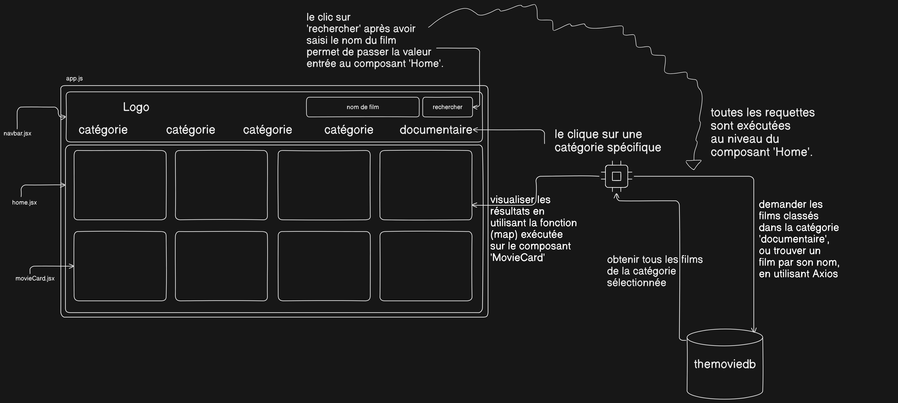

# Hulu Clone
Il s'agit d'un clone de la populaire plateforme de streaming Hulu, développé en utilisant ReactJs.

## Fonctionnalités
- Navigation et recherche dans une collection de films.
- Conception responsive s'adaptant à différentes tailles d'écran.

## Technologies utilisées
- ReactJs
- Tailwind CSS.
- Axios (pour effectuer des requêtes API).
- The Movie Database API (pour récupérer les données des films)

## Pour commencer
Pour exécuter le Hulu Clone localement, suivez ces étapes :
1. Clonez le dépôt :
   git clone https://github.com/sife22/huluclone-reactjs
2. Accédez au répertoire du projet :
   cd huluclone-reactjs
3. Installez les dépendances :
   npm install
4. Créez un fichier '.env' dans le répertoire racine et ajoutez vos clés API (https://developer.themoviedb.org/reference/intro/getting-started) :
   REACT_APP_MOVIES_API_KEY=votre_cle_api
5. Démarrez le serveur de développement :
   npm start
6. Ouvrez votre navigateur et visitez 'http://localhost:3000' pour voir le Hulu Clone.

## Déploiement
Le Hulu Clone est hébergé sur Vercel, Vous pouvez visiter l'application déployée sur https://huluclone-reactjs.vercel.app/
